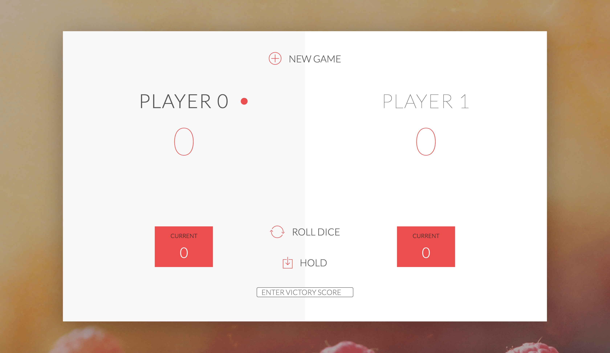

# Pig Game

I was making this game through the JavaScript course by Jonas Schmedtmann

## Game Rules

- The game has 2 players, playing in rounds
- In each turn, a player rolls a dice as many times as he whishes. Each result get added to his ROUND score
- BUT, if the player rolls a 1, all his ROUND score gets lost. After that, it's the next player's turn
- The player can choose to 'Hold', which means that his ROUND score gets added to his GLOBAL score. After that, it's the next player's turn
- The first player to reach 100 points on GLOBAL score wins the game (or you can set the highest score)

## License

The Pig Game is open-sourced software licensed under the [MIT license](https://opensource.org/licenses/MIT).
